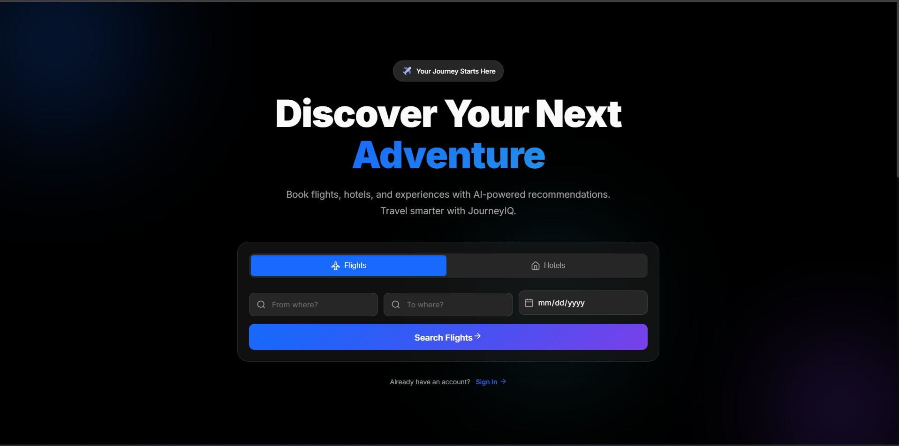
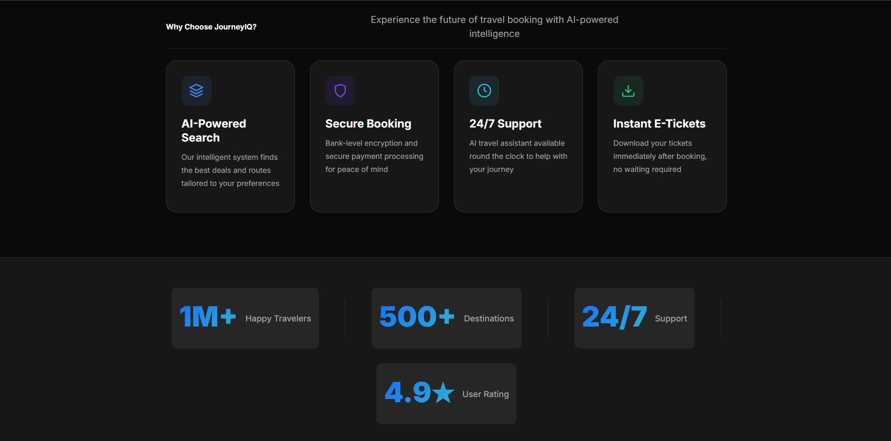
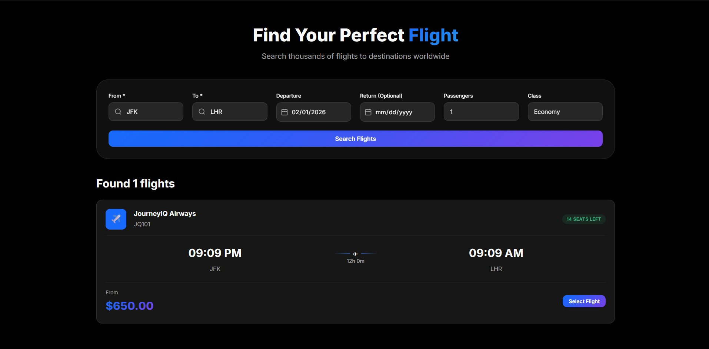
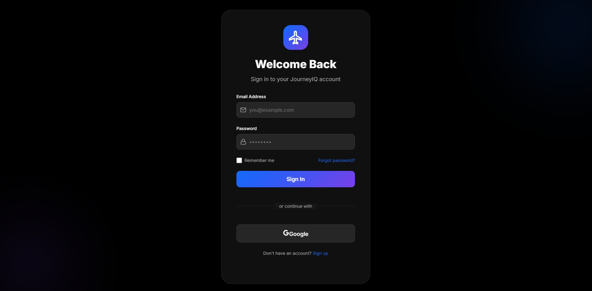
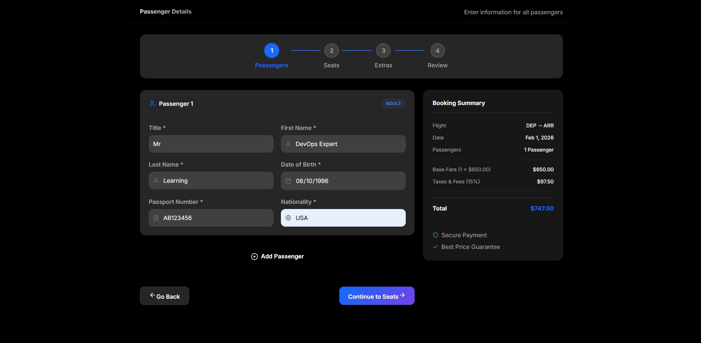
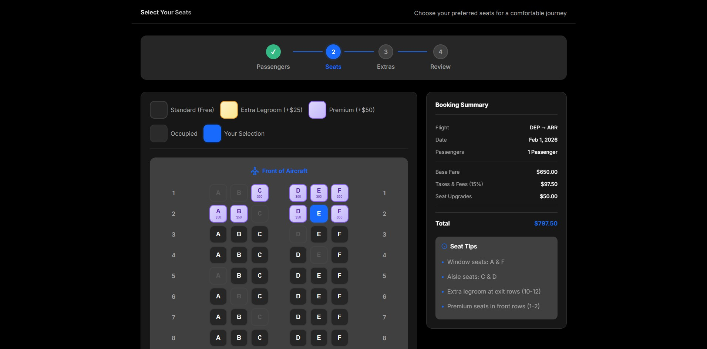
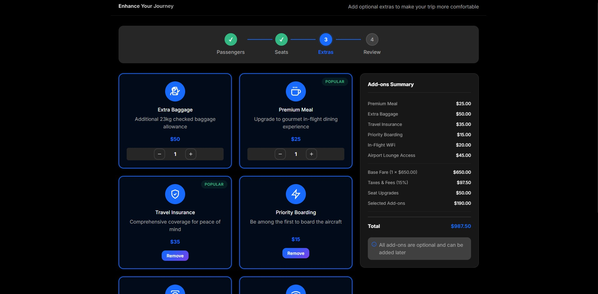
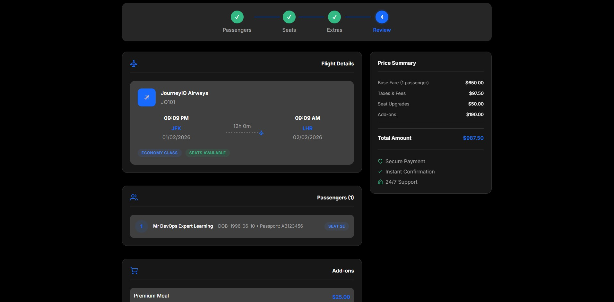
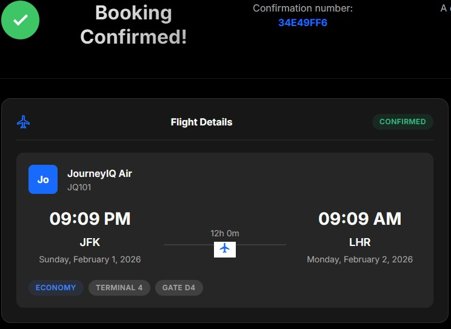

# JOURNEYIQ ARCHITECTURE CONTRACT


**SYSTEM:** JourneyIQ - Intelligent Cloud-Native Travel Booking Platform

---

## Table of Contents

- [1. System Context](#1-system-context)
- [2. Repository Structure](#2-repository-structure-authoritative)
- [3. Technology Stack](#3-technology-stack)
- [4. Local Development](#4-local-development)
- [5. Architectural Principles](#5-architectural-principles)
- [6. Design Decisions & Rationale](#6-design-decisions--rationale)
- [7. How to Test Locally](#7-how-to-test-locally)
- [8. Portfolio](#8-portfolio)

---

## 1. SYSTEM CONTEXT

JourneyIQ is a real-time Travel Booking Platform leveraging an event-driven microservices architecture. It integrates advanced AI capabilities including actionable agents and RAG (Retrieval-Augmented Generation) pipelines.

[**View Detailed Architecture & Diagrams**](docs/ARCHITECTURE.md)

**Core Stats:**
- **15 Core Microservices**
- **1 AI Agent Service** (Consolidated RAG/Vector)
- **Infrastructure:** Google Cloud Platform (GCP)
- **Orchestration:** GKE (Production), Docker Compose (Local)

---

## 2. REPOSITORY STRUCTURE (AUTHORITATIVE)

This tree defines the **rigid** structure for the repository. All code must reside in these locations.

```text
journeyiq-intelligent-cloud-native-platform/
├── services/                          # Application Logic (Language: Python/Go/Node)
│   ├── api-gateway/                   # Single Entry Point (Reverse Proxy)
│   ├── auth-service/                  # Identity, JWT handling
│   ├── user-service/                  # User profiles, preferences
│   ├── search-service/                # High-performance search (Elasticsearch/Algolia connector)
│   ├── pricing-service/               # Dynamic pricing engine
│   ├── inventory-service/             # Flight/Hotel inventory management
│   ├── booking-service/               # Saga orchestration for bookings
│   ├── payment-service/               # Payment gateway integration
│   ├── ticketing-service/             # Ticket generation (PDF/QR)
│   ├── notification-service/          # Email/SMS/Push dispatch
│   ├── review-service/                # User reviews and ratings
│   ├── analytics-service/             # Data pipeline ingestion
│   ├── ai-agent-service/              # Actionable AI Agent (LLM interface, RAG, Vector Ops)
│   ├── admin-service/                 # [NEW] System administration & monitoring
│   └── iot-service/                   # [NEW] IoT device tracking & telemetry
│
├── infra/                             # Cloud Infrastructure (Terraform) - PROD/DEV ONLY
│   ├── terraform/
│   │   ├── modules/                   # Reusable TF modules (GCP, networking, db)
│   │   └── envs/                      # Environment instantiations
│   │       ├── dev/                   # Development environment infra
│   │       └── prod/                  # Production environment infra
│   └── gcp-config/                    # IAM policies, Organization policies
│
├── k8s/                               # Kubernetes Manifests (ArgoCD/Helm/Kustomize)
│   ├── base/                          # Common manifests (Deployments, Services)
│   └── overlays/                      # Kustomize patches
│       ├── dev/                       # Development overlays
│       └── prod/                      # Production overlays
│
├── local/                             # Local Development Environment
│   ├── docker-compose.yml             # Full stack orchestration
│   ├── .env.example                   # Environment template
│   └── scripts/                       # Helper scripts (start.sh, verify_all.py)
│
├── shared/                            # Shared Contracts & Utilities
│   ├── events/                        # Event schemas (Pub/Sub)
│   ├── schemas/                       # API DTOs, Protobufs
│   └── auth/                          # Auth middleware
│
├── docs/                              # Documentation
│   ├── ARCHITECTURE.md                # System design & diagrams
│   ├── API_DOCUMENTATION.md           # Swagger endpoints
│   └── ADR/                           # Architecture Decision Records
│
└── portfolio/                         # Portfolio & Demo Assets
    ├── DEMO_SCRIPT.md                 # Demo walkthrough
    └── screenshots/                   # Visual assets
```

## 3. TECHNOLOGY STACK

### Core Technologies
- **Languages:** Python 3.11+ (FastAPI), Go, Node.js
- **Databases:** PostgreSQL 15, Vector DB (FAISS/Pinecone)
- **Message Queue:** Google Pub/Sub (Prod), Emulator (Local)
- **Cache:** Redis
- **Search:** Elasticsearch/Algolia

### AI/ML Stack
- **LLM Framework:** LangChain + LangGraph
- **Models:** Gemini Pro, Azure OpenAI, Groq
- **Vector Store:** FAISS (local), Pinecone (prod)
- **RAG Pipeline:** Custom document processing

### Infrastructure
- **Cloud:** Google Cloud Platform (GCP)
- **Orchestration:** Google Kubernetes Engine (GKE)
- **IaC:** Terraform
- **CI/CD:** GitHub Actions, Cloud Build
- **Monitoring:** Prometheus, Grafana, Cloud Logging

---

## 4. LOCAL DEVELOPMENT

### Quick Start
```bash
cd local/scripts
sudo ./start.sh
```

See [GETTING_STARTED.md](docs/GETTING_STARTED.md) for detailed setup instructions.

---

## 5. ARCHITECTURAL PRINCIPLES
    *   **NEVER** use Terraform for local development setup. Local is exclusively `docker-compose`.
    *   **NEVER** hardcode environment-specific logic (e.g., `if env == 'prod'`) inside business logic. Use configuration/dependency injection.

2.  **Container Parity:**
    *   The `Dockerfile` used in `local/` via compose **MUST** be the exact same `Dockerfile` used in K8s.
    *   Differences are handled via Environment Variables and ConfigMaps only.

3.  **Data Isolation:**
    *   **Database per Service:** No service may access another service's database tables directly.
    *   Communication must happen via **API** (Sync) or **Events** (Async).

4.  **Shared Code Limitations:**
    *    The `shared/` directory is for **CONTRACTS** (Protobufs, DTOs, interfaces) and **UTILITIES** (logging wrappers, auth middleware).
    *   It must **NOT** contain business logic. If logic is shared, it likely belongs in a service or a library, but prefer duplication over wrong abstraction.

5.  **Infrastructure as Code:**
    *   All cloud resources (buckets, topics, SAs) must be defined in Terraform.
    *   Clicking in the console is forbidden for persistent infrastructure.

---

## 6. DESIGN DECISIONS & RATIONALE

### Why this structure?
This "Monorepo for Services, Split for Infra" approach balances the speed of development with the rigor of operations.

1.  **Service Colocation:** Keeping all microservices in one repo (`services/`) simplifies cross-service refactoring and integration testing, which is critical for a complex booking platform with 15+ components.
2.  **Separate Local/Cloud Paths:** Using Docker Compose for local development ensures developers can run the entire stack on a laptop without an internet connection or cloud costs, while K8s/Terraform provides the robustness needed for Prod.
3.  **Centralized Contracts (`shared/`):** In an event-driven system, schema drift is the enemy. Centralizing event definitions and API schemas prevents breaking changes.
4.  **Kustomize for K8s:** Using Base/Overlays allows us to keep the manifest definitions DRY (Don't Repeat Yourself) while easily overriding specific parameters (like replica counts or CPU limits) for Dev vs Prod.

---

## 7. HOW TO TEST LOCALLY

We have created an automated startup script to make local testing effortless. This will spin up the entire ecosystem (15 microservices + Infrastructure + AI + Observability) using Docker Compose.

### Prerequisites
- Docker Engine & Docker Compose installed
- 8GB+ RAM available
- `curl` installed

### Steps to Run

1.  **Navigate to the scripts directory:**
    ```bash
    cd local/scripts
    ```

2.  **Run the automated startup script:**
    ```bash
    ./start.sh
    ```

    **What happens next?**
    *   The script will check for a `.env` file. If missing, it creates one from `.env.example`.
    *   **ACTION REQUIRED:** It will pause and ask you to edit `../.env` to add your **Gemini API Key** (or OpenAI key).
    *   After you confirm, it spins up Postgres, Pub/Sub emulator, and all 15 microservices.
    *   It finally launches Grafana and Prometheus and prints a "Health Check" summary.

### Verification

Once the "JourneyIQ Platform Started!" message appears:

**1. Access the API Gateway**
Visit [http://localhost:8000/docs](http://localhost:8000/docs) to see the unified API documentation (or individual service ports listed in the script output).

**2. Test the AI Agent**
Use `curl` or Postman to chat with the agent:
```bash
curl -X POST "http://localhost:8000/agent/chat" \
     -H "Content-Type: application/json" \
     -d '{"user_id": "test-user", "message": "Find me a flight from NYC to London"}'
```

**3. View Metrics & Monitoring**
*   **Grafana:** [http://localhost:3000](http://localhost:3000) (Login: `admin` / `admin`)
*   **Prometheus:** [http://localhost:9090](http://localhost:9090)

### Troubleshooting
*   **Port Conflicts:** Ensure ports 8000-8015, 5432, and 3000 are free.
*   **Logs:** Run `docker-compose logs -f [service_name]` inside the `local/` folder to debug specific services.

---


## 8. PORTFOLIO

### Dashboard & Home Screens

<table>
  <tr>
    <td width="50%">
      <a href="docs/home-1.jpg">
        
      </a>
      <br>
      <em>Home Screen - Main View</em>
    </td>
    <td width="50%">
      <a href="docs/home-2.jpg">
        
      </a>
      <br>
      <em>Home Screen - Alternate View</em>
    </td>
  </tr>
  <tr>
    <td>
      <a href="docs/home-3.jpg">
        
      </a>
      <br>
      <em>Search Results</em>
    </td>
    <td>
      <a href="docs/home-5.jpg">
        
      </a>
      <br>
      <em>User Profile</em>
    </td>
  </tr>
  <tr>
    <td>
      <a href="docs/home-6.jpg">
        
      </a>
      <br>
      <em>Booking Flow - Step 1</em>
    </td>
    <td>
      <a href="docs/home-7.jpg">
        
      </a>
      <br>
      <em>Booking Flow - Step 2</em>
    </td>
  </tr>
  <tr>
    <td>
      <a href="docs/home-8.jpg">
        
      </a>
      <br>
      <em>Booking Flow - Step 3</em>
    </td>
    <td>
      <a href="docs/home-9.jpg">
        
      </a>
      <br>
      <em>Booking Flow - Step 4</em>
    </td>
  </tr>
  <tr>
    <td>
      <a href="docs/home-10.jpg">
        
      </a>
      <br>
      <em>Payment Screen</em>
    </td>
    <td>
      <a href="docs/HOME-11.jpg">
        
      </a>
      <br>
      <em>Confirmation Success</em>
    </td>
  </tr>
</table>


