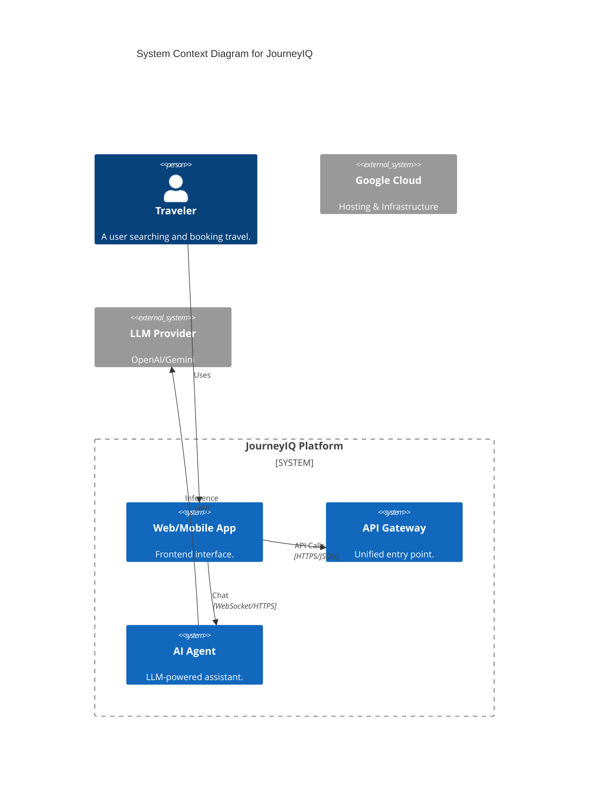
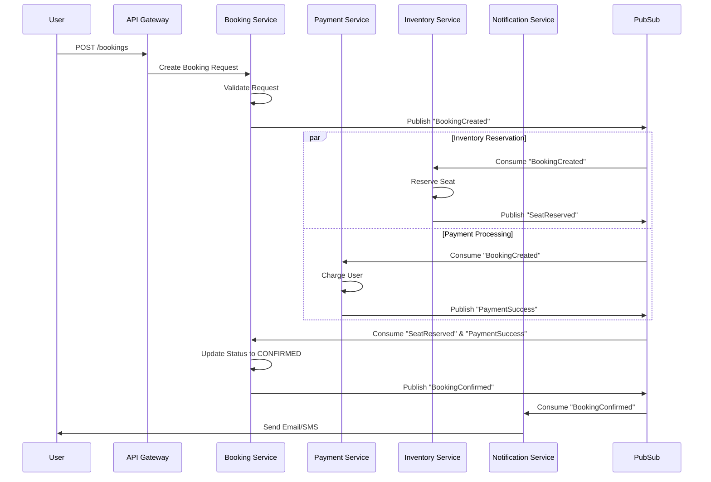

# System Architecture

## System Context
JourneyIQ is a cloud-native travel booking platform designed for scale and resilience. It uses a microservices architecture on Google Kubernetes Engine (GKE).



## Microservices Event Flow (The Booking Saga)
Communication between services is handled primarily via synchronous API calls for reads and asynchronous Events (Pub/Sub) for writes and sagas.



## AI Agent RAG Pipeline
The AI Agent uses a RAG pipeline to answer policy-related questions.

```mermaid
flowchart LR
    User(User Query) --> Agent
    Agent --> Router{Is Policy?}
    Router -- Yes --> Vector store
    Vector store -- SIMILARITY SEARCH --> Documents
    Documents --> Context
    Context --> LLM
    LLM --> Response
    Router -- No --> Tools(Flight Search/Booking)
    Tools --> Response
```
